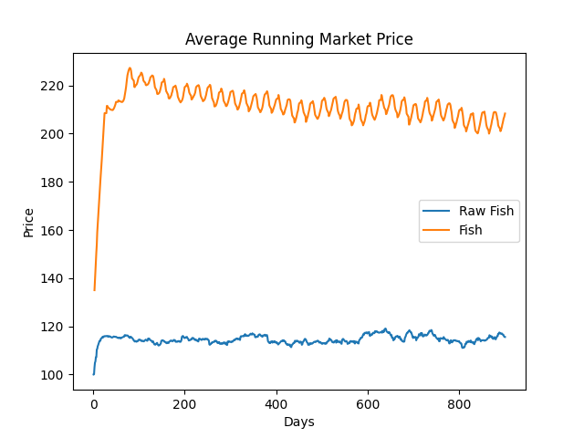
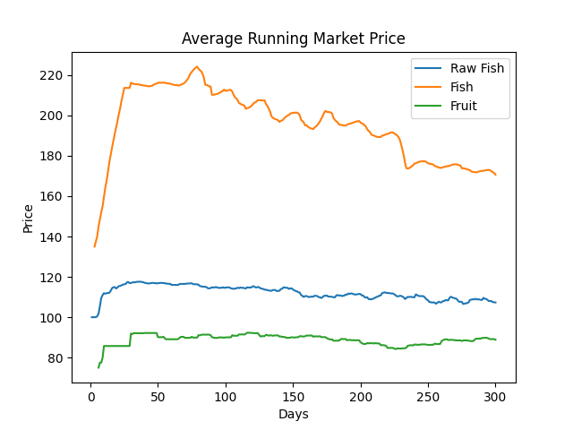
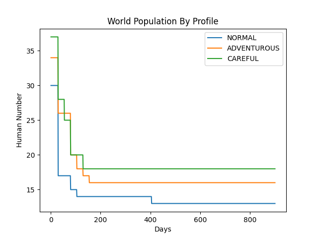

# Chef and Fisherman

- The stable ratio of Chef vs Fisherman seems to be between 3 and 5
- In the end, the number of Fish is skyrocketing while the number of raw fish take a really long time to ramp up
- The price of raw_fish is pretty stable, however the price of cooked fish is oscillating every 30 days,
  with a rise of price when people are hungry and then the price going down again.
  Overall trend of price is going down.

- Does this oscillation appears when there is an additional source of food? Since the frequency is based on the whole
  population getting hungry at the same point? Not really, the oscillation is less clean but still here when adding
  as many Gatherer and as many Chefs.

- For the trader profile, it doesn't seem to have a great impact from this experiment only:

- Fun fact, having a single human both fishing and cooking is perfectly viable

---

# Ideas

Additional ideas I get from this experiment are:

- Refining the profile system to see if one can lead to a better survival chance
- Trying to diminish the stockpiling of food by adding the chance for food to go stale
- Make the Chef job more realistic by making them have the risk of destroying the raw fish if preparing it badly
